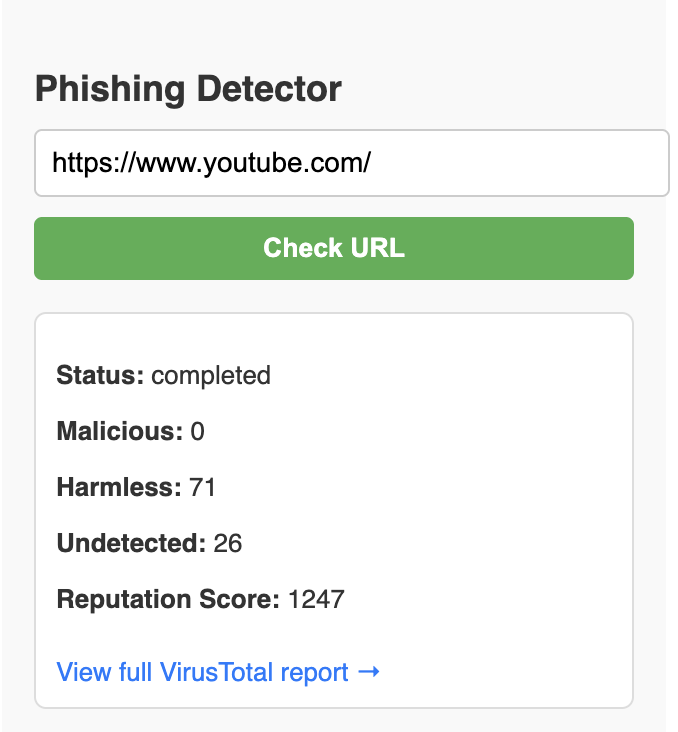
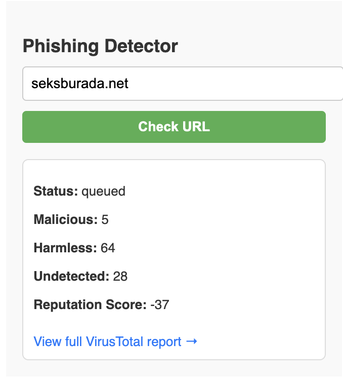

# Phishing Detection Browser Extension

## 🛡️ About the Project

This is a browser extension designed to detect potentially phishing URLs using both basic heuristic rules and VirusTotal API integration. The current implementation includes a minimal React-based UI and a Node.js backend for comprehensive threat detection. It includes a minimal UI and basic detection logic, and is intended for personal testing and future development.

## 🚀 Setup Guide (Phase 1 - Skeleton)

Follow these steps to run the extension locally in Chrome:

1. Clone or download this repository to your local machine.

2. Open Google Chrome and go to: `chrome://extensions/`

3. Enable **Developer mode** in the top-right corner.

4. Click **"Load unpacked"** and select the folder where the extension files (including `manifest.json`) are located.

5. Visit any URL (e.g., `https://example.com/login`) and see the extension alert you about possible phishing links.

6. Click the extension icon to view the popup UI which displays the URL and detection status.

## 🚀 Setup Guide (Phase 2 - Testing and Integration)

### 🔧 Backend API Setup

1. Navigate to the backend folder:
```bash
cd phishing-api
```

2. Install dependencies:
```bash
npm install
```

3. Create a `.env` file:
```env
PORT=3001
VIRUSTOTAL_API_KEY=your_virustotal_api_key_here
```

4. Start the server:
```bash
node server.js
```

### 🎨 Frontend Setup

1. Navigate to the frontend folder:
```bash
cd phishing-extension-ui
npm run build
```

2. Open `chrome://extensions` in Chrome.

3. Click **"Load unpacked"** → Select the `dist/` folder from `phishing-extension-ui`.

## 📁 Directory Overview

```
phishing_BE/
├── phishing-api/
│   ├── model/
│   ├── routes/
│   ├── tests/
│   ├── server.js
│   ├── .env
│   └── package.json
├── phishing-extension-ui/
│   ├── public/
│   ├── src/
│   │   ├── popup.jsx
│   │   ├── popup.css
│   │   └── main.jsx
│   └── manifest.json
├── demo/
│   └── images/
│       ├── malicious.png
│       └── non-malicious.png
└── README.md
```

## 📽️ Demo

Here is a screen recording of the basic skeleton demo of the phishing detection extension in action:

<video src="demo/initial_skeleton_demo/basic_phishing_url_demo.mov" controls width="600"></video>

## 🖼️ Screenshots

### Extension Interface


### Detection Results
The extension provides detailed analysis including:
- **Status**: completed
- **Malicious**: 0
- **Harmless**: 71  
- **Undetected**: 26
- **Reputation Score**: 1247



## 🔧 Features

- **Real-time URL Analysis**: Instant phishing detection using heuristic rules
- **VirusTotal Integration**: Comprehensive threat intelligence via VirusTotal API
- **Visual Feedback**: Clean, intuitive popup interface showing detection results
- **Reputation Scoring**: Advanced scoring system for URL trustworthiness
- **Developer Mode**: Easy testing and development setup

## 🛠️ Technical Stack

- **Frontend**: React, JavaScript, Chrome Extension APIs
- **Backend**: Node.js, Express.js
- **Security**: VirusTotal API integration
- **Development**: VS Code, Chrome Developer Tools

## 🔐 API Configuration

The extension integrates with VirusTotal for enhanced threat detection. Make sure to:

1. Sign up for a VirusTotal API key
2. Add your API key to the `.env` file
3. Restart the backend server

## 🚀 Future Development

This project is designed for expansion with advanced detection models and machine learning capabilities. Let us know if you'd like to contribute or expand this with advanced detection models!

## 📋 Requirements

- Node.js (v14 or higher)
- Chrome Browser
- VirusTotal API Key (for Phase 2)
- NPM or Yarn package manager

## 🤝 Contributing

Feel free to contribute to this project by submitting pull requests or reporting issues. This is currently in active development for educational and security research purposes.